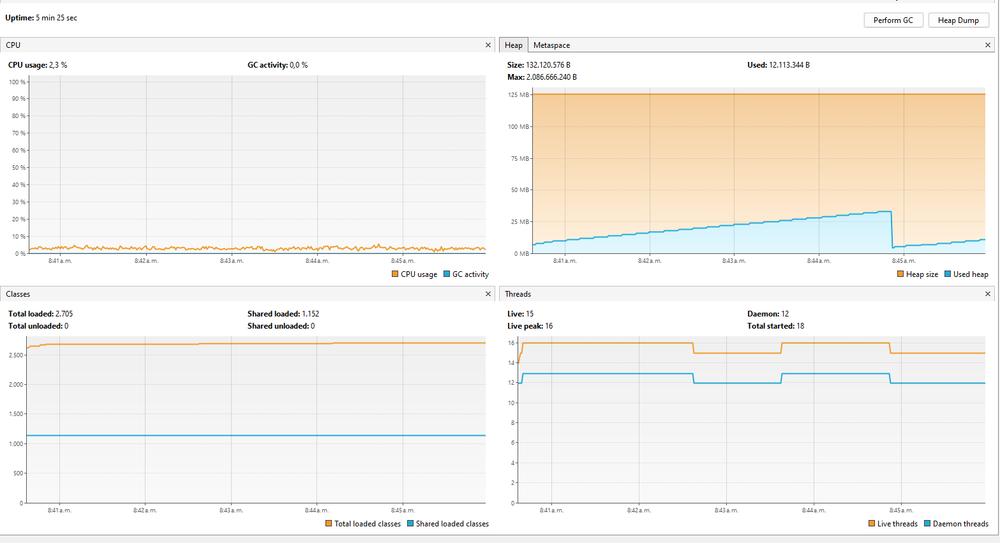
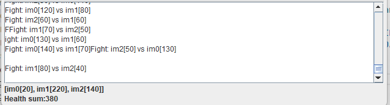
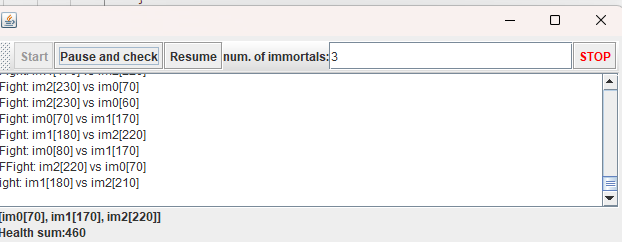
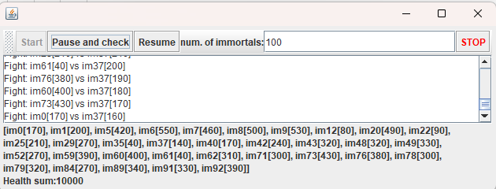
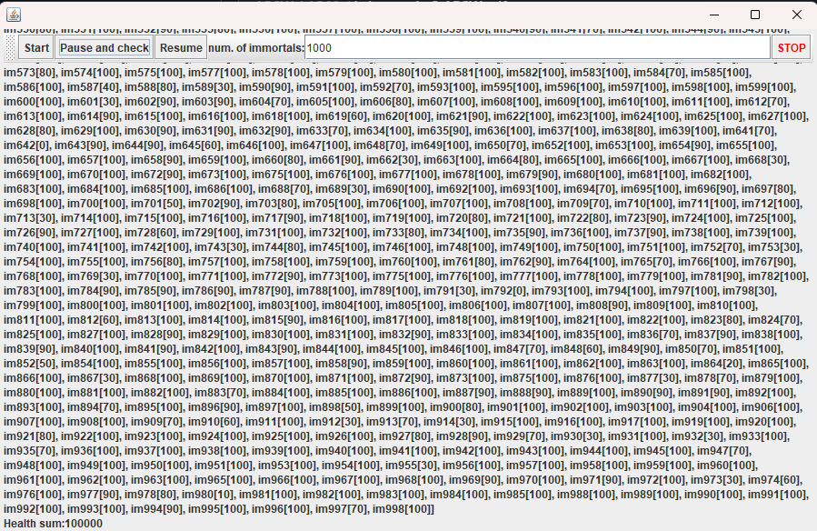
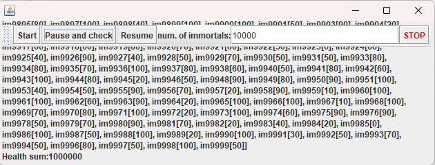

# Lab03_ARSW

#### Andrea Valentina Torres Tobar
#### Andres Serrato Camero


### Control de hilos con wait/notify. Productor/consumidor.




el consumo se debe a la ejecucion permanente de un hilo que añade un numero a una queue esto se ejecuta en la clase `Producer` pues esta tiene un bucle infinito sin control

```java 
    public void run() {
        while (true) {

            dataSeed = dataSeed + rand.nextInt(100);
            System.out.println("Producer added " + dataSeed);
            queue.add(dataSeed);
            
            try {
                Thread.sleep(1000);
            } catch (InterruptedException ex) {
                Logger.getLogger(Producer.class.getName()).log(Level.SEVERE, null, ex);
            }
        }
    }
```

- para solucionar el problema del consumo hacemos uso de `synchronized(queue)` para garantizar el acceso exclusivo
- `wait()` para cuanbdo no hay elemtos
- `notifyall()` cuando se produce/consume

esto hace que los hilos ahora duerman cuando no tienen trabajo 

Producer
``` java
public void run() {
        while (true) {
            dataSeed = dataSeed + rand.nextInt(100);
            System.out.println("Producer added " + dataSeed);
            queue.add(dataSeed);

            while (queue.size() == stockLimit) {
                    try {
                        queue.wait();
                    } catch (InterruptedException e) {
                        throw new RuntimeException("Error" + e);
                    }
                }
            
            try {
                Thread.sleep(100);
            } catch (InterruptedException ex) {
                Logger.getLogger(Producer.class.getName()).log(Level.SEVERE, null, ex);
            }
        }
    }
```

tambien se modifico consumer para que espere cuando la cola este vacia 

``` java
public void run() {
        while (true) {

            if (queue.size() > 0) {
                int elem = queue.poll();
                System.out.println("Consumer consumes " + elem);
            }

            try {
                Thread.sleep(100);
            } catch (InterruptedException e) {
                System.out.println("Error" + e);
            }

        }
    }
```

realizando estos cambios este es el nuevo consumo que tiene la CPU 


para hacer que producer produzca mas rapido lo que hacemos es disminuir el tiempo en el try 
``` java 
try {
    Thread.sleep(10);
}
```

y realizamos la accion contraria en consumer

``` java 
try {
    Thread.sleep(1000);
} catch (InterruptedException e) {
    System.out.println("Error" + e);
}
```


## parte II


## parte III

#### 2.  para este caso el valor deberia ser  

    `Healthsum = N * DEFAULT_IMMORTAL_HEALTH`

#### 3.  La invariante no se cumple pues `DEFAULT_IMMORTAL_HEALTH = 100 ` y `N = 3`
    por lo que `Healthsum` deberia ser  `3 * 100 = 300` 

     

#### 4. primero completamos la funcion `"pause and check"` y la funcion `"resume"` para poder completar esto necesitamos primero crear methodos nuevos dentro de `Immortal` para la detencion y reanudacion de los hilos

    ```java
    public synchronized void pause() {
        this.pause = true;
    }

    public synchronized void resumeThread() {
        this.pause = false;
        notify();
    }
    ```
    ademas de esto necesitamos  modificar  el metodo `run()` para que mientras este pausado el hilo este no se ejecute 


    ```java 
    public void run() {

        while (true) {

            synchronized (this) {
                while (pause) {
                    try {
                        wait();
                    } catch (InterruptedException e) {
                        e.printStackTrace();
                    }
                }
            }

            Immortal im;

            int myIndex = immortalsPopulation.indexOf(this);

            int nextFighterIndex = r.nextInt(immortalsPopulation.size());

            //avoid self-fight
            if (nextFighterIndex == myIndex) {
                nextFighterIndex = ((nextFighterIndex + 1) % immortalsPopulation.size());
            }

            im = immortalsPopulation.get(nextFighterIndex);

            this.fight(im);

            try {
                Thread.sleep(1);
            } catch (InterruptedException e) {
                e.printStackTrace();
            }

        }

    }
    ```
    luego de esto si realizamos la debida implementacion de las acciones de los botones


    ``` java 
            JButton btnPauseAndCheck = new JButton("Pause and check");
        btnPauseAndCheck.addActionListener(new ActionListener() {
            public void actionPerformed(ActionEvent e) {

                for (Immortal im : immortals) {
                    im.pause();
                }
                int sum = 0;
                for (Immortal im : immortals) {
                    sum += im.getHealth();
                }

                statisticsLabel.setText("<html>" + immortals.toString() + "<br>Health sum:" + sum);

            }
        });

        JButton btnResume = new JButton("Resume");

        btnResume.addActionListener(new ActionListener() {
            public void actionPerformed(ActionEvent e) {
                for (Immortal im : immortals) {
                    im.resumeThread();
                }

            }
        });
    ```


#### 5. aun no se cumple la invariante 



####  6. se modifico el metodo fight de `Immortals` 

``` java 
    public void fight(Immortal i2) {

        synchronized (immortalsPopulation) {
            if (i2.getHealth() > 0) {
                if (i2.getHealth() != 0) {
                    i2.changeHealth(i2.getHealth() - defaultDamageValue);
                    this.health += defaultDamageValue;
                }
                updateCallback.processReport("Fight: " + this + " vs " + i2 + "\n");
            } else {
                updateCallback.processReport(this + " says:" + i2 + " is already dead!\n");
                immortalsPopulation.remove(i2);
                i2.pause();
            }
        }
    }
```

7. no se pauso 


8. no se realizo una estrategia pues no se tuvo que corregir ningun problema 


9. 
    para `100`
    
    

    para `1000`

    

    para `10000`

    

#### 10. Múltiples hilos intentan modificar la lista compartida simultáneamente junto a esto los immortales que ya han muerto puden causar errores en la ejecucion del programa por lo cualuna de las soluciones es remover al immortal cuando este ya este muerto

    
```java
updateCallback.processReport(this + " says:" + i2 + " is already dead!\n");
                immortalsPopulation.remove(i2);
                i2.pause();
```


#### 11.  se implemento el boton `STOP` que al parar se vuelve a activar el boton `Start`

```java
        JButton btnStop = new JButton("STOP");
        btnStop.addActionListener(new ActionListener() {
            public void actionPerformed(ActionEvent e) {
                for (Immortal im : immortals) {
                    im.pause();
                }
                btnStart.setEnabled(true);
            }
        });
        btnStop.setForeground(Color.RED);
        toolBar.add(btnStop);
```