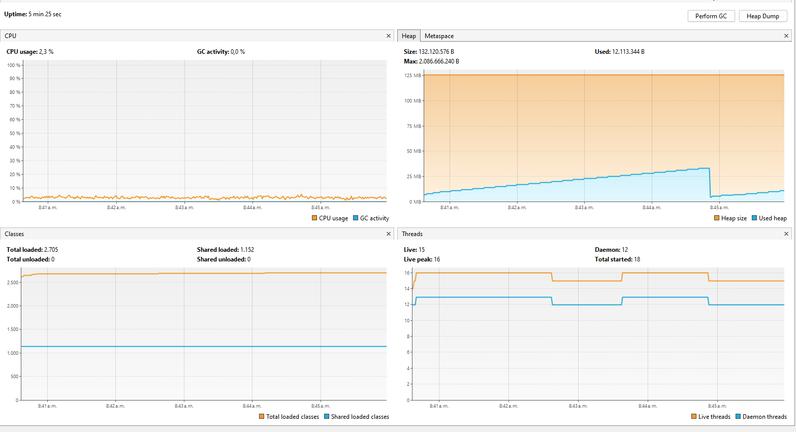

# Lab03_ARSW

#### Andrea Valentina Torres Tobar
#### Andres Serrato Camero


### Control de hilos con wait/notify. Productor/consumidor.




el consumo se debe a la ejecucion permanente de un hilo que añade un numero a una queue esto se ejecuta en la clase `Producer` pues esta tiene un bucle infinito sin control

```java 
    public void run() {
        while (true) {

            dataSeed = dataSeed + rand.nextInt(100);
            System.out.println("Producer added " + dataSeed);
            queue.add(dataSeed);
            
            try {
                Thread.sleep(1000);
            } catch (InterruptedException ex) {
                Logger.getLogger(Producer.class.getName()).log(Level.SEVERE, null, ex);
            }
        }
    }
```