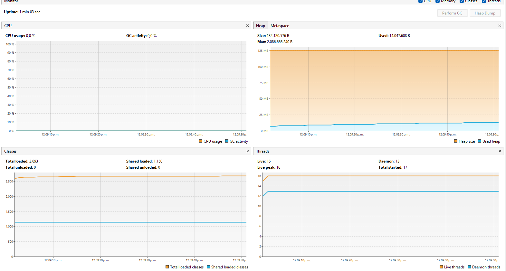

# Lab03_ARSW

#### Andrea Valentina Torres Tobar
#### Andres Serrato Camero


### Control de hilos con wait/notify. Productor/consumidor.


el consumo se debe a la ejecucion permanente de un hilo que añade un numero a una queue esto se ejecuta en la clase `Producer` pues esta tiene un bucle infinito sin control

```java 
    public void run() {
        while (true) {

            dataSeed = dataSeed + rand.nextInt(100);
            System.out.println("Producer added " + dataSeed);
            queue.add(dataSeed);
            
            try {
                Thread.sleep(1000);
            } catch (InterruptedException ex) {
                Logger.getLogger(Producer.class.getName()).log(Level.SEVERE, null, ex);
            }
        }
    }
```

- para solucionar el problema del consumo hacemos uso de `synchronized(queue)` para garantizar el acceso exclusivo
- `wait()` para cuanbdo no hay elemtos
- `notifyall()` cuando se produce/consume

esto hace que los hilos ahora duerman cuando no tienen trabajo 

Producer
``` java
public void run() {
        while (true) {
            dataSeed = dataSeed + rand.nextInt(100);
            System.out.println("Producer added " + dataSeed);
            queue.add(dataSeed);

            while (queue.size() == stockLimit) {
                    try {
                        queue.wait();
                    } catch (InterruptedException e) {
                        throw new RuntimeException("Error" + e);
                    }
                }
            
            try {
                Thread.sleep(100);
            } catch (InterruptedException ex) {
                Logger.getLogger(Producer.class.getName()).log(Level.SEVERE, null, ex);
            }
        }
    }
```

tambien se modifico consumer para que espere cuando la cola este vacia 

``` java
public void run() {
        while (true) {

            if (queue.size() > 0) {
                int elem = queue.poll();
                System.out.println("Consumer consumes " + elem);
            }

            try {
                Thread.sleep(100);
            } catch (InterruptedException e) {
                System.out.println("Error" + e);
            }

        }
    }
```

realizando estos cambios este es el nuevo consumo que tiene la CPU 


